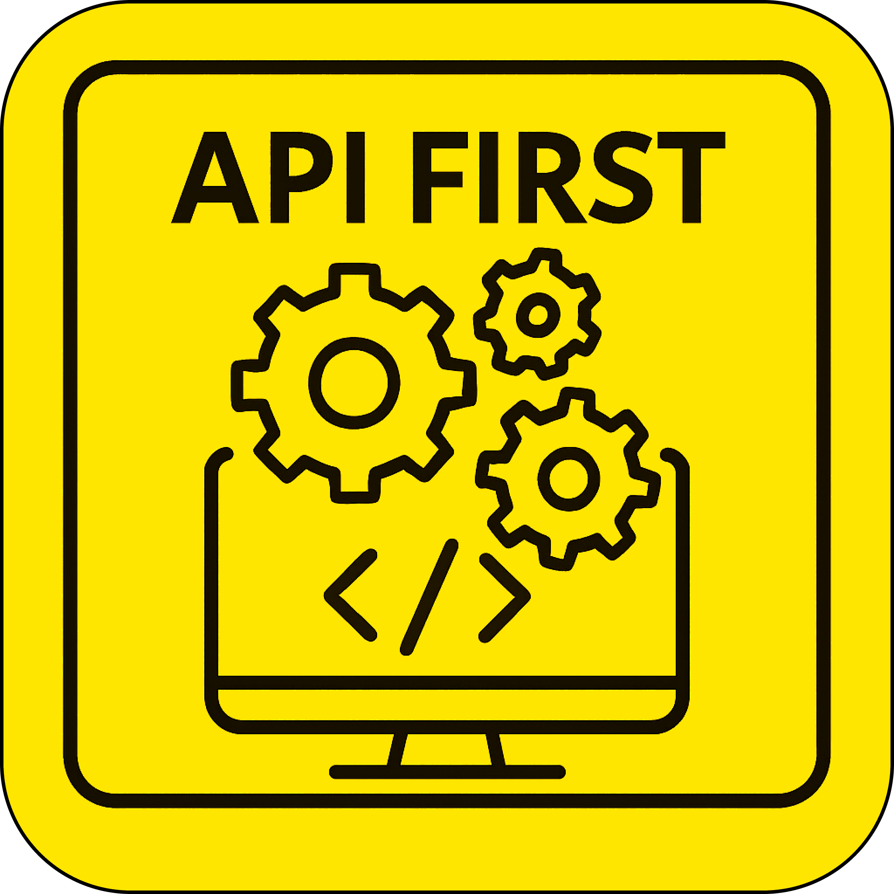

<!-- PROJECT LOGO -->  
   

  
    

<h3 align="center">API First Guide</h3>

  
  
   Единая точка входа к информации по процессу разработки <b>API</b> в банке   
       
  
  
     

  

- [🚀 Быстрый старт](#-быстрый-старт)
  - [С чего начать?](#с-чего-начать)
- [📚 Структура руководства](#-структура-руководства)
  - [1. Getting Started](#1-getting-started)
  - [2. Практики API First](#2-практики-api-first)
  - [3. API Guide](#3-api-guide)
  - [4. Инструменты](#4-инструменты)
  - [5. Публикация API](#5-публикация-api)
  - [6. Use Cases](#6-use-cases)
  - [7. Примеры реализации](#7-примеры-реализации)

## 🚀 Быстрый старт

### С чего начать?
1. **[Изучите Getting Started Guide](getting-started/README.md)** - пошаговое руководство для команд
2. **[Примените практики](practices/README.md)** API First в вашей команде
3. **[Выберите инструменты](tools/README.md)** для вашего стека технологий
4. **[Следуйте API Guide](rules/rules.md)** для соблюдения стандартов банка

## 📚 Структура руководства

### 1. [Getting Started](getting-started/README.md)
Пошаговое руководство для команд, которые хотят начать работать по API First:
- Что такое API First и зачем он нужен
- Чеклист готовности команды
- Roadmap внедрения API First
- Частые вопросы и решения

### 2. [Практики API First](practices/README.md)
- Совместное создание контрактов (Contract First Design)
- Хранение спецификаций (моно-репозиторий vs микросервисы)
- API Review процесс

### 3. [API Guide](rules/rules.md)
Стандарты и правила разработки API в банке:
- Принципы проектирования REST API
- Человекочитаемые правила
- OpenSource процесс внесения изменений

### 4. [Инструменты](tools/README.md)
Готовые инструменты для работы по API First:
- **Редакторы спецификаций**
- **Кодогенерация**
- **Mock-серверы**
- **Тестирование**
- **Валидация**
- **Документация**

### 5. [Публикация API](publishing/README.md)
Как опубликовать ваше API:
- **Внутренний портал**
- **Внешний портал**

### 6. [Use Cases](use-cases/README.md)
Руководства для специфических типов API:
- Файловое API (upload/download)
- Асинхронное API (async tasks, webhooks)
- Batch операции
- GraphQL в банке
- Event-driven API

### 7. [Примеры реализации](examples/README.md)
Реальные кейсы команд банка