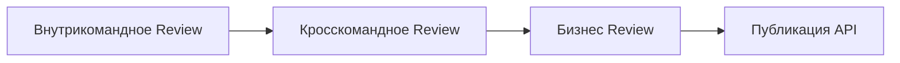
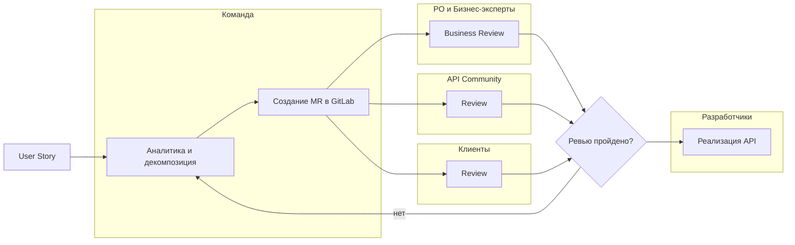

# Практики API First

> 🎯 Проверенные подходы к организации процессов разработки по API First


- [Практики API First](#практики-api-first)
  - [Contract First Design](#contract-first-design)
    - [Что это?](#что-это)
    - [Как организовать процесс](#как-организовать-процесс)
      - [1. Kick-off встреча](#1-kick-off-встреча)
      - [2. Итеративная доработка](#2-итеративная-доработка)
      - [3. Финализация контракта](#3-финализация-контракта)
    - [Лучшие практики](#лучшие-практики)
    - [Антипаттерны](#антипаттерны)
  - [API Review процесс](#api-review-процесс)
    - [Уровни Review](#уровни-review)
    - [1. Внутрикомандное Review](#1-внутрикомандное-review)
    - [2. Кросскомандное Review](#2-кросскомандное-review)
    - [3. Бизнес Review](#3-бизнес-review)
    - [4. Клиентское Review](#4-клиентское-review)
    - [Общий процесс проведения ревью](#общий-процесс-проведения-ревью)
    - [Инструменты для Review](#инструменты-для-review)
  - [Хранение спецификаций](#хранение-спецификаций)
    - [Подходы к организации](#подходы-к-организации)
      - [1. Монорепозиторий API](#1-монорепозиторий-api)
      - [2. API в репозитории сервиса](#2-api-в-репозитории-сервиса)


## Contract First Design

### Что это?
Подход, при котором контракт (спецификация API) создается до написания кода и является договоренностью между всеми участниками разработки.

### Как организовать процесс

#### 1. Kick-off встреча
**Участники**: Product Owner, Tech Lead, Backend, Frontend, Mobile, QA
**Результат**: Черновик API спецификации

**Agenda:**
- Обзор бизнес-требований
- Определение ресурсов и endpoints
- Проектирование моделей данных
- Обсуждение edge cases

#### 2. Итеративная доработка
- Создание MR с черновиком спецификации
- Комментарии и предложения от всех участников
- Ежедневные 15-минутные синки при необходимости

#### 3. Финализация контракта
- API Review (см. ниже)
- Фиксация версии
- Запуск разработки

### Лучшие практики
- ✅ **Вовлекайте всех с самого начала** - Frontend знает, какие данные нужны для UI. QA знает какие кейсы нужно покрыть.
- ✅ **Думайте о будущем** - Закладывайте расширяемость, но не over-engineering
- ✅ **Документируйте API** - Реальные примеры запросов/ответов и описание модели данных помогает понять API

### Антипаттерны
- ❌ Backend создает API в изоляции
- ❌ Frontend "подстраивается" под готовое API
- ❌ Изменения вносятся без обсуждения

## API Review процесс

### Уровни Review



### 1. Внутрикомандное Review
- **Кто участвует**: Вся команда разработки
- **Фокус**: Соответствие требованиям, полнота, удобство использования

**Чек-лист:**
- [ ] Все требования покрыты endpoints
- [ ] Модели данных оптимальны
- [ ] Нет дублирования функциональности
- [ ] Примеры реалистичны
- [ ] Обработка ошибок продумана

### 2. Кросскомандное Review
- **Кто участвует**: API Community, представители смежных команд
- **Фокус**: Соответствие стандартам банка, переиспользование

**Чек-лист:**
- [ ] Соблюдены стандарты именования
- [ ] Используются общие модели данных
- [ ] Нет конфликтов с существующими API
- [ ] Безопасность учтена

### 3. Бизнес Review
- **Кто участвует**: Product Owners, Бизнес-эксперты
- **Фокус**: Бизнес-ценность, применимость для клиентов

### 4. Клиентское Review
- **Кто участвует**: Клиенты банка, партнеры, Product Owners, Бизнес-эксперты
- **Фокус**: Соответствие потребностям клиента, применимость для клиентов

### Общий процесс проведения ревью


### Инструменты для Review
- **GitLab MR** - основной инструмент для review
- **FigJam** - для визуализации архитектуры

## Хранение спецификаций

### Подходы к организации

#### 1. Монорепозиторий API
```
api/
├── payments/
│   ├── payment-service/
│   │   └── openapi.yaml
│   ├── payment-resolver-service/
│   │   └── openapi.yaml
├── accounts/
│   └── accounts-service/
│       └── openapi.yaml
└── public/
    └── payment-gateway/
        ├── openapi.yaml
```

**Плюсы:**
- ✅ Единое место для всех API
- ✅ Легко переиспользовать API
- ✅ Можно настроить автоматизацию в одном месте
- ✅ Простой поиск

**Минусы:**
- ❌ Права доступа для всех
- ❌ Еще один репозиторий
- ❌ Нужно придумать удобную структуру для команды

#### 2. API в репозитории сервиса
```
payment-service/
├── src/
│   ├── main/
│   │   ├── java/
│   │   └── resources/
│   │       └── openapi.yaml
│   └── test/
├── docs/
└── tests/
```
или
```
payment-service/
├── openapi.yaml
├── src/
│   ├── main/
│   │   ├── java/
│   │   └── resources/
│   └── test/
├── docs/
└── tests/
```

**Плюсы:**
- ✅ API рядом с кодом
- ✅ Версионирование вместе с сервисом
- ✅ Права доступа совпадают

**Минусы:**
- ❌ Сложнее найти все API
- ❌ Автоматизацию нужно настраивать в каждом репозитории

---

> 💡 **Помните**: Практики - это не догма. Адаптируйте их под нужды вашей команды и проекта.